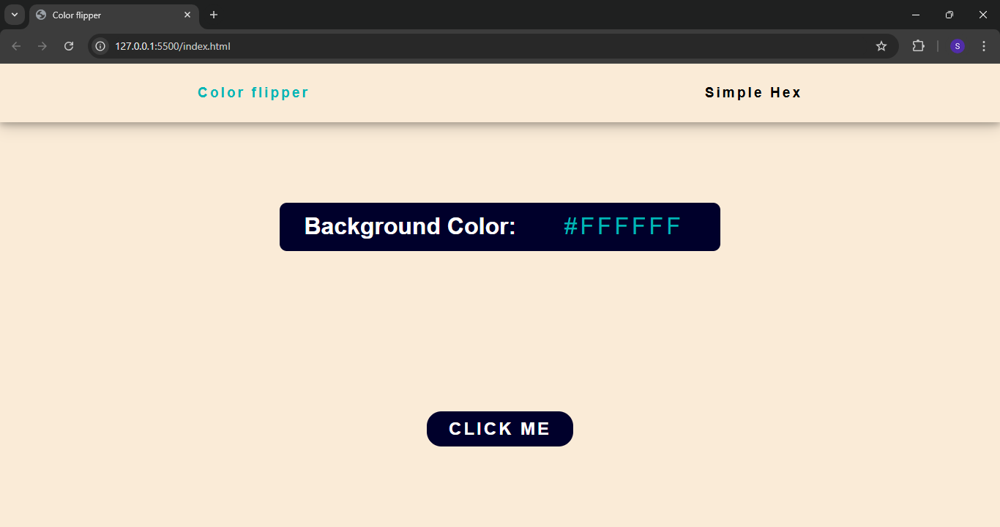
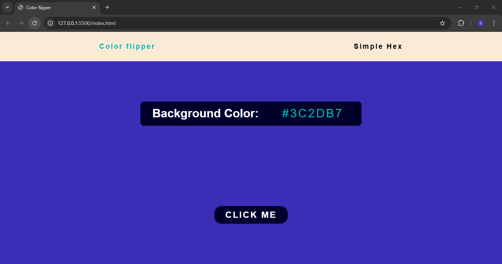

# Color Flipper

A simple color flipper project built using HTML, CSS, and JavaScript. This application generates random hex colors and updates the background when the button is clicked.

## 📌 Features
- Generates a random hex color on button click
- Displays the generated hex color
- Smooth UI with a minimalistic design
- Includes a click sound effect for better user experience

## 🛠️ Technologies Used
- **HTML5** - Structure of the application
- **CSS3** - Styling and layout
- **JavaScript** - Logic for generating hex colors and updating the UI

## 📷 Screenshot

**Before Clicking the button**

 

**After Clicking the button**

 

